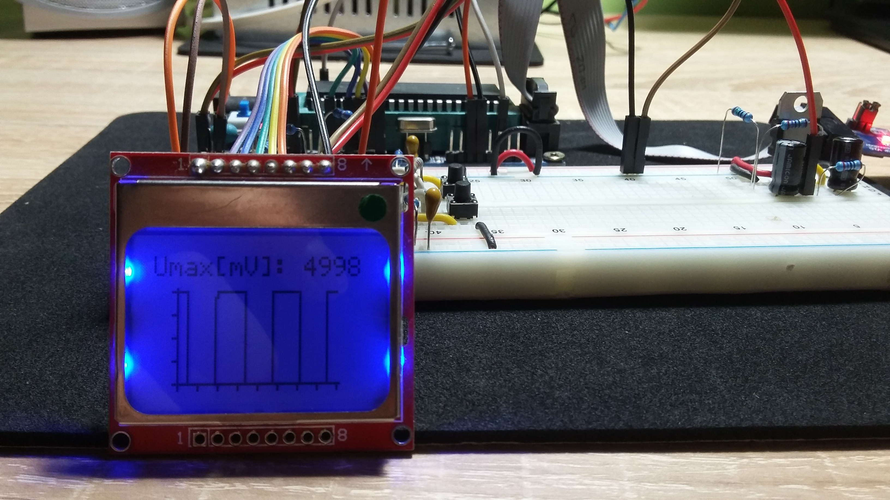

# PCD8544 48 × 84 pixels matrix LCD driver

## PCD8544 Description
Detailed information are described in [Datasheet PCD8544](https://www.sparkfun.com/datasheets/LCD/Monochrome/Nokia5110.pdf).

## Library
C library for driving Nokia 5110 LCD display with PCD8544 Driver through SPI's Atmega16.

### Usage
Prior defined for MCU Atmega16 / Atmega8. Need to be carefull with SPI ports definition.

| PORT  | [Atmega16](http://ww1.microchip.com/downloads/en/devicedoc/doc2466.pdf) | [Atmega8](https://ww1.microchip.com/downloads/en/DeviceDoc/Atmel-2486-8-bit-AVR-microcontroller-ATmega8_L_datasheet.pdf) |
| :---: | :---: | :---: |
| SS | PB4 | PB2 |
| MOSI | PB5 | PB3 |
| MISO | PB6 | PB4 |
| SCK | PB7 | PB5 |

### Tested
Library was tested and proved on a **_Nokia 5110 LCD display_** with **_Atmega16_**.

## Demonstration

## Acknowledgement
https://github.com/mvadai/muonhunter/blob/master/avr/
